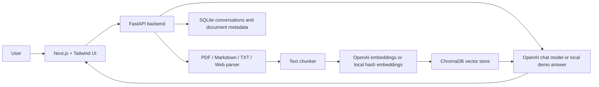

# AI Knowledge QA System

上传 PDF、Markdown、TXT 或网页，系统自动建立知识库，并支持带引用来源的多轮问答。

## Highlights

- Document upload: PDF, TXT, Markdown
- Web page ingestion
- RAG pipeline: extraction, chunking, embeddings, vector retrieval, cited answers
- Agent-style routing: retrieves knowledge context when available, otherwise gives a careful fallback
- Streaming chat over Server-Sent Events
- Knowledge base CRUD
- Conversation persistence with SQLite
- ChromaDB vector database in Docker/Linux, with a Windows-friendly local JSON fallback
- Docker Compose one-command startup
- Deployment-ready Railway and Vercel configuration

## Architecture



## Tech Stack

| Layer | Choice |
| --- | --- |
| Frontend | Next.js, React, Tailwind CSS |
| Backend | FastAPI, Python |
| RAG | Custom pipeline, ChromaDB with local fallback |
| LLM | DeepSeek or OpenAI API, with local demo fallback |
| Storage | SQLite metadata, ChromaDB vectors |
| Deployment | Vercel frontend, Railway backend, Docker Compose locally |

## Quick Start

```bash
cp .env.example .env
docker compose up --build
```

Open:

- Frontend: http://localhost:3000
- Backend health: http://localhost:8000/api/health

The project can run without an LLM key for demos. Add `DEEPSEEK_API_KEY` or `OPENAI_API_KEY` to enable production-quality answers. If only DeepSeek is configured, embeddings use the local fallback index.

## Local Development

Backend:

```bash
cd backend
python -m venv .venv
.venv\Scripts\activate
pip install -r requirements.txt
uvicorn app.main:app --reload
```

Optional ChromaDB install on Linux/macOS or Windows with C++ Build Tools:

```bash
pip install -r requirements-chroma.txt
```

Frontend:

```bash
cd frontend
npm install
npm run dev
```

## API

| Method | Endpoint | Purpose |
| --- | --- | --- |
| GET | `/api/health` | Service health |
| GET | `/api/documents` | List knowledge documents |
| POST | `/api/documents/upload` | Upload PDF/TXT/Markdown |
| POST | `/api/documents/web` | Ingest a web page |
| DELETE | `/api/documents/{id}` | Delete a document and vectors |
| POST | `/api/chat/stream` | Stream an answer with citations |

## Deployment

The detailed click-by-click deployment checklist is in [`docs/DEPLOYMENT.md`](docs/DEPLOYMENT.md).

### Backend on Railway

1. Create a Railway project from this GitHub repository.
2. Leave the root directory as the repository root. The repo includes a root `railway.json` and `Dockerfile`.
3. Add environment variables:
   - `OPENAI_API_KEY`
   - `OPENAI_MODEL=gpt-4o-mini`
   - `OPENAI_EMBEDDING_MODEL=text-embedding-3-small`
   - Or use `DEEPSEEK_API_KEY` and `DEEPSEEK_MODEL=deepseek-chat`
   - `BACKEND_CORS_ORIGINS=https://your-vercel-domain.vercel.app`
4. The backend includes `railway.json`, so Railway can use:

```bash
uvicorn app.main:app --host 0.0.0.0 --port $PORT
```

5. Generate a public Railway domain and verify `/api/health`.

### Frontend on Vercel

1. Import the same repository into Vercel.
2. Leave the root directory as the repository root. The root Next.js app is the deployable frontend.
3. Add:

```bash
NEXT_PUBLIC_API_BASE_URL=https://your-railway-backend.up.railway.app
```

4. Deploy.

## Roadmap

- Supabase or PostgreSQL for multi-user production storage
- Auth and per-user knowledge bases
- Hybrid search with BM25 plus vectors
- Evaluation set for answer faithfulness
- Demo GIF and hosted demo link
